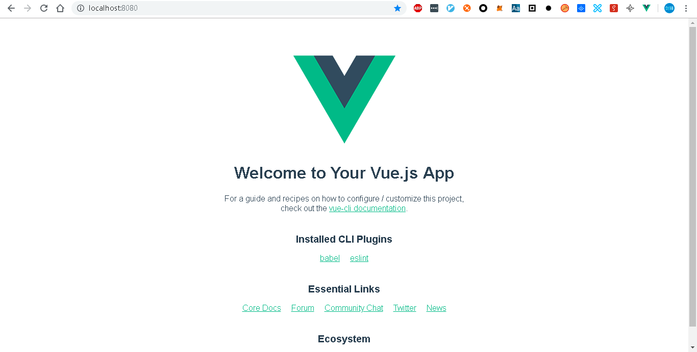

# gxc-card-game-repo
Migration from https://github.com/EOSIO/eosio-card-game-repo, develop with  vue + gxbjs  + gScatter  

初稿：Li Smith

审阅：

# 第1课 智能合约和前端安装

欢迎来到元素战斗的第一课。在下面的课程中，我们将构建在gxc区块链之上运行的第一个区块链dApp。与任何其他dApp一样，元素战有两个重要组成部分，即智能合约和前端。

公信链智能合约是用C ++编写的，因此C ++知识将是一个优势。但不要担心，本教程的内容也很简单，即使你不了解C++，只要你有任何的编程背景，都可以跟上并理解。


对于前端，我们将使用Vue（一个高效且灵活的Javascript库）来构建用户界面，以及Vuex，一个与Vue配合良好的状态管理容器。


### 1.1课程目标

第1课的目标是启动开发dApp所需的文件。两个主要组成部分是智能合约和前端。

在本课程结束时，您应该已经创建了必要的目录结构和文件，以便您开始开发gxc dApp。


### 1.2智能合约起步

首先，我们将建立我们的智能合约。为了使模块更加模块化，我们的智能合约将分为3个文件，分别是：

- `cardgame.hpp` - 定义智能合约的C ++头文件。
- `cardgame.cpp` - 实现智能合约操作的C ++源文件。
- `gameplay.cpp` - 包含我们智能合约中使用的内部帮助函数的C ++源文件。


你可以使用喜欢的文本编辑器或IDE（我们使用VSCode）并创建这三个文件.


让我们先从从cardgame.cpp定义合约类开始,我们将会调用我们的合约类cardgame.


 合约中table名和action的名称需要满足GXC的命名约定，

(1)只能包含如下字符 abcdefghijklmnopqrstuvwxyz12345

(2)最多只能包含12个字符

(3)必须以英文字母开始


我们创建一个集成自graphene::contract的类，让我们完成以下步骤。

- 我们创建一个构造函数来调用基类（`graphene::contract`）的构造函数。
- 构造函数需要遵循以下参数约定：
  - 拥有合约的帐户
- 最后，我们通过包含`graphenelib/graphene.hpp`使我们可以访问GXC的公共库，这些对于开发智能合约非常有用。

cardgame.hpp 内容如下

```
#include <graphenelib/graphene.hpp>
using namespace graphene;

class cardgame : public contract {

  public:
    cardgame(uint64_t id)
        : contract(id)
	{
    }
};
```

该`cardgame.hpp`头文件将被`gameplay.cpp使用`。gameplay.cpp内容如下

```
#include "cardgame.hpp"
```


且gameplay.cpp将在cardgame.cpp中使用。cardgame.cpp内容如下

```
#include "gameplay.cpp"
```


最后，我们需要在一个名为GRAPHENE_ABI的宏中注册我们的合约，我们需要传递合约类名，以及GRAPHENE_ABI宏可用的action列表。但是，由于我们还没有任何动作，现在让我们传递空序列（由BOOST_PP_SEQ_NIL宏表示）

cardgame.cpp内容如下

```
#include "gameplay.cpp"

GRAPHENE_ABI(cardgame, BOOST_PP_SEQ_NIL)
```


### 1.3前端起步

现在我们将使用JavaScript库**Vue**为游戏创建基于Web的前端。首先，请确保您的系统中安装了Node.js. 您可以参考[nodejs.org](https://nodejs.org/en/download/)上的官方指南 并选择**Node.js**的LTS版本。元素战斗dApp是使用**Node.js 8.16.0**开发的。


我们将使用[vue-cli](https://www.npmjs.com/package/@vue/cli)创建一个Vue Web应用程序。它是最受欢迎的工具链之一，可帮助开发人员快速设置预配置的Vue项目，以构建单页应用程序(SPA)。

完成此基本设置后，您可以立即运行 刚刚创建的简单**Vue**应用程序。我们开始做吧！

只需从终端运行以下命令即可创建基本应用程序。中间选项可以按回车键选择默认

```
npm install -g @vue/cli
vue create my-app
```

然后切换到新创建的应用程序目录。

```
cd my-app
```

并按如下方式运行Web应用程序：

```
 npm run serve
```

在Web浏览器中输入 http://localhost:8080/ 应看到如下界面。



有关更多信息，请参阅有关如何启动**Vue**  应用程序的官方文档：https://cli.vuejs.org/。

### 1.4自定义Vue App

在[课程库中](https://github.com/dharmachain/gxc-card-game-repo/tree/lesson-1)，您可以 在前端文件夹中找到**Vue**应用程序的修改版本。它由**vue-cli**生成， 但我们重新组织了文件和文件夹结构，以便为我们将要进行的所有更改奠定基础。我们来看看文件`frontend`夹中的文件。       

文件`index.html`位于该`public/`文件夹中。它提供了整个Web应用程序的基本主干。index.html内容如下：

```
<!DOCTYPE html>
<html lang="en">
  <head>
    <meta charset="utf-8">
    <meta http-equiv="X-UA-Compatible" content="IE=edge">
    <meta name="viewport" content="width=device-width,initial-scale=1.0">
    <link rel="icon" href="<%= BASE_URL %>favicon.ico">
    <title>my-app</title>
  </head>
  <body>
    <noscript>
      <strong>We're sorry but my-app doesn't work properly without JavaScript enabled. Please enable it to continue.</strong>
    </noscript>
    <div id="app"></div>
    <!-- built files will be auto injected -->
  </body>
</html>

```


文件App.vue位于src/。我们通常将此视为主应用程序文件。App.vue内容如下：

```
<template>
  <div id="app">
    
    <HelloWorld msg="Welcome to Your Vue.js App"/>
  </div>
</template>

<script>
import HelloWorld from './components/HelloWorld.vue'

export default {
  name: 'app',
  components: {
    HelloWorld
  }
}
</script>

<style>
#app {
  font-family: 'Avenir', Helvetica, Arial, sans-serif;
  -webkit-font-smoothing: antialiased;
  -moz-osx-font-smoothing: grayscale;
  text-align: center;
  color: #2c3e50;
  margin-top: 60px;
}
</style>

```


文件main.js，这是Vue应用程序的起点，该文件告诉Vue App在id为app的DOM元素上渲染App组件。

```
import Vue from 'vue'
import App from './App.vue'

Vue.config.productionTip = false

new Vue({
  render: h => h(App),
}).$mount('#app')

```


### 1.5课程摘要

在本课中，我们介绍了智能合约的基本构建块以及如何设置基本的Vue应用程序。您可以点击以下链接，详细了解我们在此处介绍的主题。

https://github.com/dharmachain/gxc-card-game-repo/tree/lesson-1


在下一课中，您将了解如何实现游戏的第一个功能，登录功能以及如何将Vue登录表单连接到智能合约。在第2课见！


创建Vue App的链接

https://cli.vuejs.org/


智能合约入门

[https://docs.gxchain.org/zh/contract/#%E5%85%A5%E9%97%A8%E6%8C%87%E5%AF%BC](https://docs.gxchain.org/zh/contract/#入门指导)